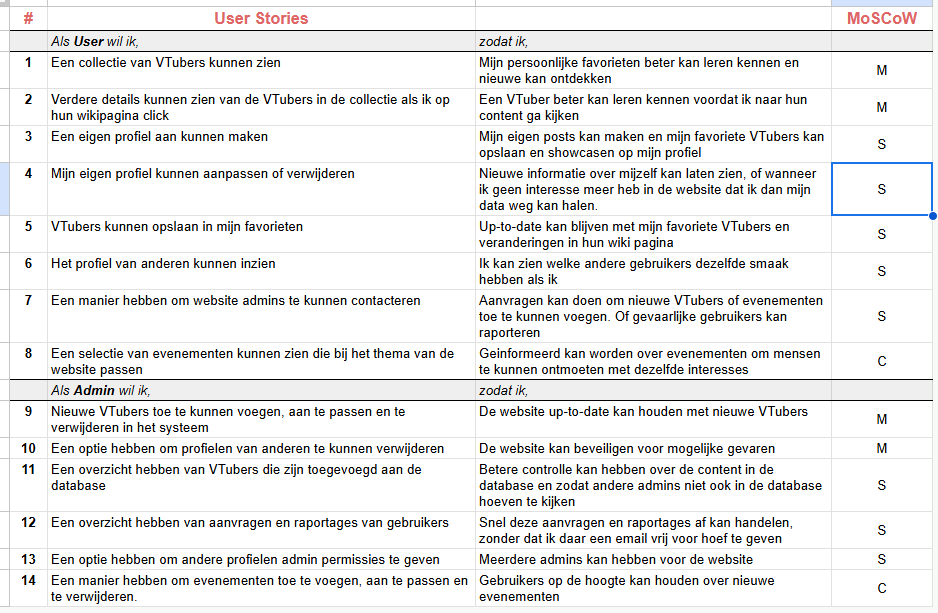
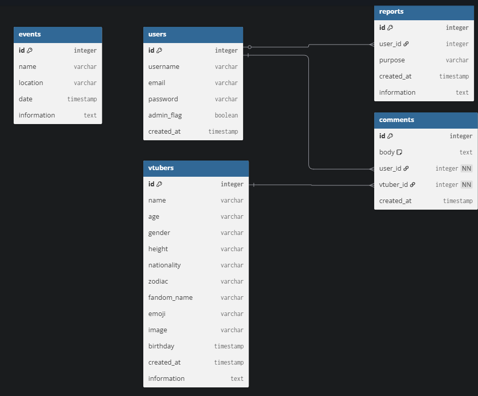
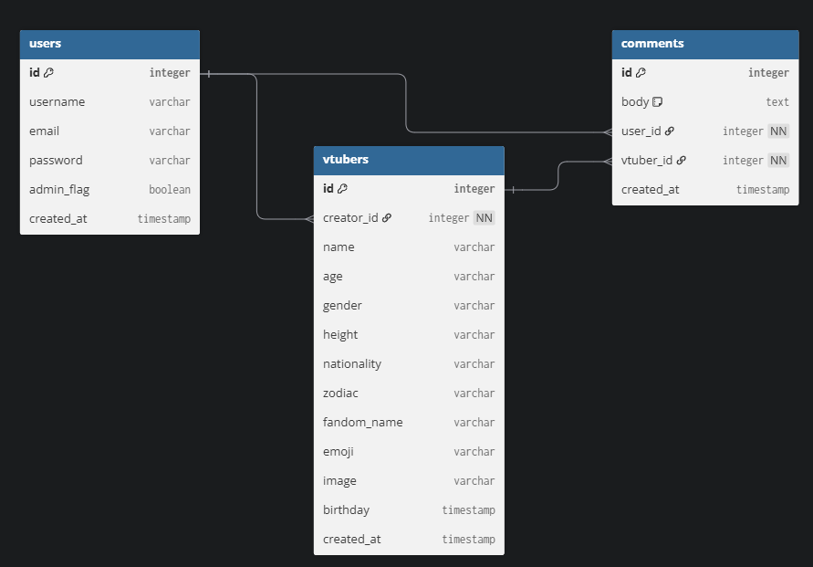

# Maandag 13 October 2025
Ook vandaag heb ik vrij genomen van het project.

# Zondag 12 October 2025
Ik heb vandaag vrij genomen van het project.

# Zaterdag 11 October 2025
Vandaag heb ik vooral gefocust op mijn verslag zodat ik het vandaag in kan leveren, om de druk daarachter te verlichten.
Gelukkig heb ik op Dinsdag 7 October al mijn 3 frameworks getest aan de hand van de voorwaarden in de Toelichting, zoals de routes en controllers. Dus ik moest alleen nog mijn verslag afmaken.

- Verslag afgemaakt

# Vrijdag 10 October 2025
Vandaag ben ik weer verder gegaan met het project. Ik moet even aankijken hoe de gemiste tijd effect heeft op mijn planning.

- Userstories gemaakt en MoSCoW methode toegepast
- ERD aangepast
- Breeze toegevoegd aan het project, dit was ik vergeten tijdens de set-up
- Om te oefenen met Routes, Views en Controllers heb ik een simpele contactpagina gemaakt
- ProductController (genaamd VTuberController) aangemaakt
- About Us pagina aangemaakt om te testen met het meegeven van data vanuit de router naar de view
- Routing verder onderzocht met hulp van Claude en Documentatie, hierdoor heb ik de show functie in de controller uit kunnen werken.

## Userstories op dit moment

## ERD op dit moment

## Onderzochte bronnen
- https://laravel.com/docs/12.x/controllers#resource-controllers
- [Claude Chat](images/Claude.png)

Ik streef ervoor om zo transparant mogelijk te zijn met mijn AI gebruik, ik laat AI namelijk ook nooit onderdelen zelf schrijven, en voeg ook alleen dingen toe die ik zelf ook kan uitleggen. De show pagina verschilt eigenlijk niet veel met de index functie, alleen geeft het nu een parameter door.

## Planning voor dit weekend
- Productenoverzicht met Dummy data
- Verslag afschijven en inleveren

# Donderdag 9 October 2025
Ik was vandaag te ziek om verder aan het project te werken, dus ik heb helaas niks kunnen doen.

# Woensdag 8 October 2025
Ik was helaas ziek vandaag dus ik moest even kijken wat ik vandaag af kon krijgen.
Gelukkig had ik gisteren al gezien dat we met Routing moesten gaan werken dus dit wist ik al wel. Heb ik ook al kunnen toevoegen aan de startprojecten van mijn verslag.

- Initial commit
- README aangemaakt en toegevoegd aan _changelog directory
- Onderzocht hoe de Changelog in werking zou gaan binnen dit project
- ERD gemaakt.

## ERD op dit moment

Ik ben nog niet helemaal tevreden met de ERD, ik wil nog wat dingen aanpassen. Maar dan wil ik meer zicht hebben op wat ik allemaal kan doen met Laravel.

